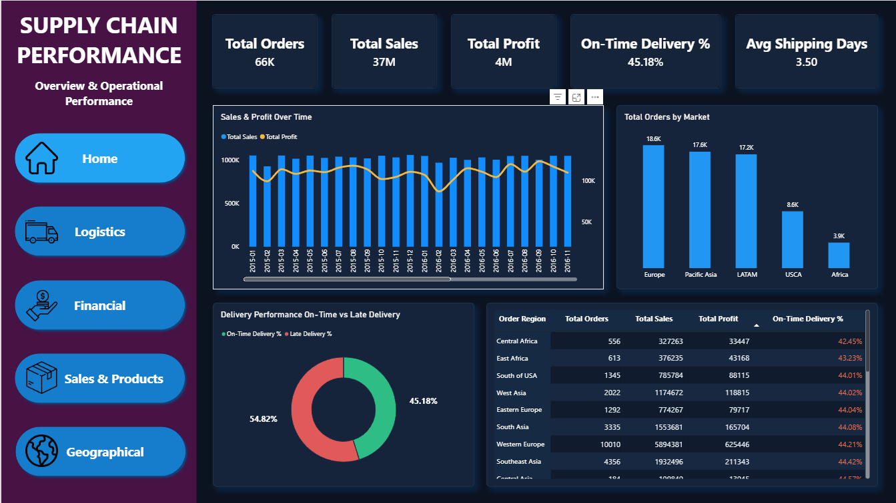
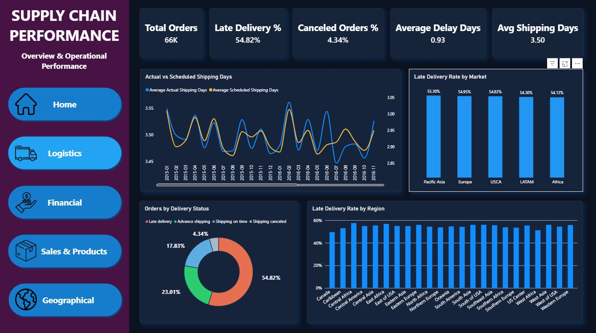
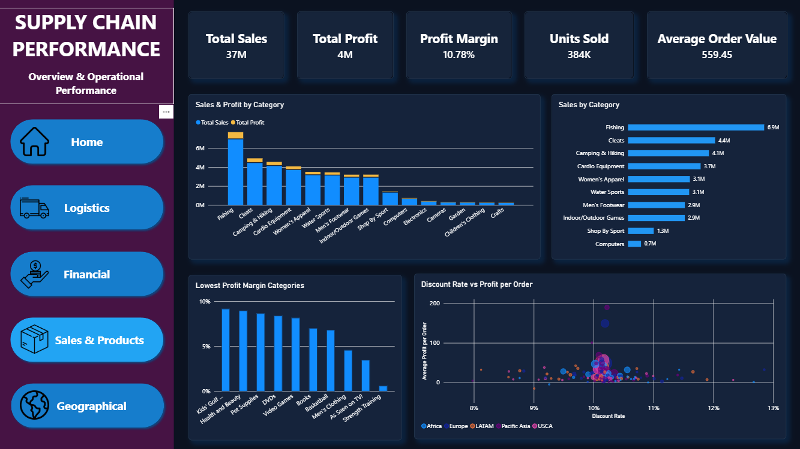
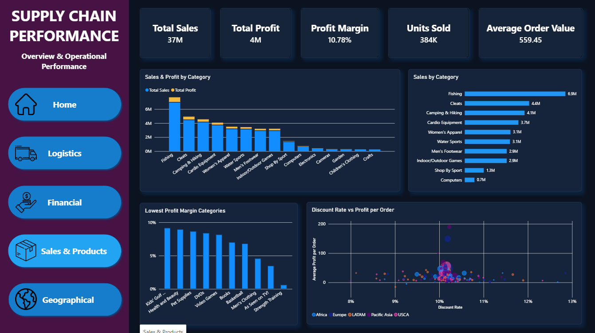
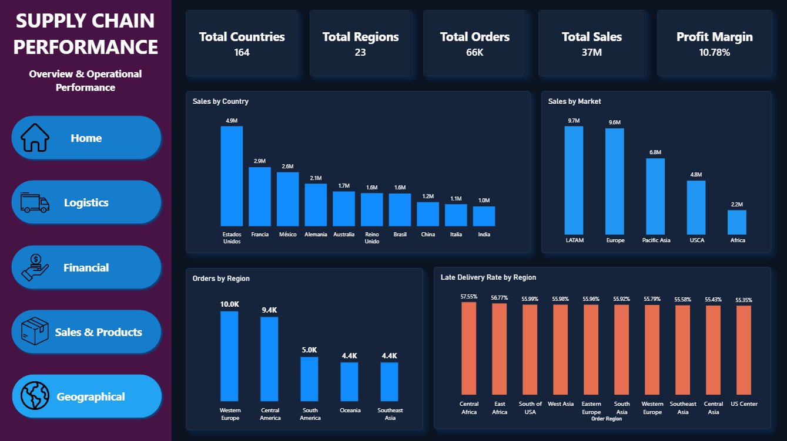

# Supply Chain Performance Dashboard — Power BI

Interactive Supply Chain and Logistics dashboard developed in Microsoft Power BI to analyze operational performance, delivery efficiency, financial results, sales performance, products, markets, and geographical distribution.

## Project Overview

This project was developed to provide a comprehensive view of supply chain performance through interactive dashboards and KPIs.

The analysis focuses on identifying delivery risks, evaluating shipping performance, understanding sales and profitability, comparing markets and regions, and analyzing product performance.

The dashboard is divided into five analytical pages:

- Home — Overall supply chain performance overview
- Logistics — Delivery and shipping performance analysis
- Financial — Sales, profit, margins, and discounts analysis
- Sales & Products — Product and category performance
- Geographical — Sales, orders, markets, and regional performance

## Key Performance Indicators

The dashboard includes KPIs such as:

- Total Orders
- Total Sales
- Total Profit
- Profit Margin
- On-Time Delivery %
- Late Delivery %
- Canceled Orders %
- Average Shipping Days
- Average Delay Days
- Average Order Value
- Total Discount
- Units Sold
- Total Countries
- Total Regions

## Dashboard Pages

### Home
Provides an executive overview of the supply chain, including:

- Total orders, sales, and profit
- On-time delivery rate
- Average shipping days
- Sales and profit over time
- Orders by market
- Delivery performance
- Regional performance
  


### Logistics
Focuses on operational and delivery performance:

- Actual vs scheduled shipping days
- Late delivery rate by market
- Orders by delivery status
- Late delivery rate by region
- Average delay
- Canceled orders



### Financial
Analyzes the financial performance of the supply chain:

- Sales and profit over time
- Sales and profit by market
- Profit margin by market
- Average order value
- Discount rate vs profit per order



### Sales & Products
Provides a detailed analysis of product and category performance:

- Sales and profit by category
- Sales by category
- Lowest profit margin categories
- Discount rate vs profit per order
- Units sold
- Product profitability



### Geographical
Analyzes the geographical distribution of operations:

- Sales by country
- Sales by market
- Orders by region
- Late delivery rate by region
- Geographic distribution of customers and orders



## Key Insights

Some of the main findings identified through the dashboard include:

- A significant portion of orders experience late delivery, highlighting an important operational improvement opportunity.
- Europe, LATAM, and Pacific Asia represent some of the largest markets by order volume and sales.
- Delivery performance varies considerably across regions and markets.
- Shipping performance can differ between actual and scheduled delivery times.
- Product categories show significant differences in sales volume and profit margin.
- Discount levels and profitability can be analyzed together to identify potential opportunities for pricing and commercial optimization.
- The geographical analysis highlights the concentration of sales and orders across specific countries and regions.

## Tools & Technologies

- Microsoft Power BI
- Power Query
- DAX
- Data Cleaning & Transformation
- Data Analysis
- Data Visualization
- Kaggle Dataset

## Data

The project uses the DataCo Supply Chain Dataset, containing information related to:

- Orders
- Customers
- Products
- Sales
- Profit
- Discounts
- Delivery status
- Shipping times
- Markets
- Regions
- Countries
- Product categories

The dataset contains approximately 180,000 order records and more than 50 attributes.

## Project Structure

```text
Dashboard - Logistica/
│
├── dashboard/
│   └── dashboard - Logistica.pbix
│
├── data/
│   └── DataCoSupplyChainDataset.csv
│
└── images/
    ├── dashboard-preview-home.png
    ├── dashboard-preview-logistics.png
    ├── dashboard-preview-financial.png
    ├── dashboard-preview-sales.png
    └── dashboard-preview-geographical.png
